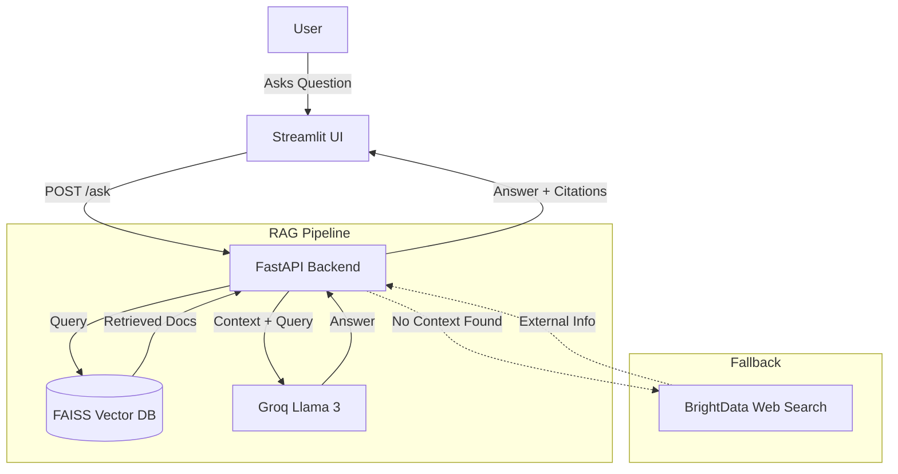

# Bylaw Buddy - RAG Law Chatbot

Bylaw Buddy is an AI-powered legal assistant designed to help users navigate complex legal documents (specifically Indian laws in this context). It uses a Retrieval-Augmented Generation (RAG) pipeline to provide accurate answers sourced directly from local PDF documents, with a fallback to web search for broader queries.

## Demo Video

[](https://youtu.be/WF867tQd5mk)

## Features

- **RAG Pipeline**: accurately answers questions based on uploaded PDF documents.
- **Citation Tracking**: every answer includes citations with the exact page number and a text snippet.
- **PDF Highlighting**: users can generate and download a PDF with the relevant sections highlighted.
- **Web Search Fallback**: automatically searches the web (via BrightData) if the information is not found in local documents.
- **Interactive UI**: built with Streamlit for a chat-like experience.
- **Fast & Efficient**: uses FAISS for vector search and Groq's Llama 3 for rapid inference.

## Tech Stack

- **Backend**: FastAPI, Python
- **Frontend**: Streamlit
- **AI/ML**: LangChain, HuggingFace Embeddings (`all-MiniLM-L6-v2`), FAISS (Vector DB), Groq (Llama 3.3-70b)
- **PDF Processing**: PyMuPDF, PyPDF
- **Web Scraping**: BrightData

## Project Structure

```
rag-law-chatbot/
├── backend/                # FastAPI backend
│   ├── data/               # Folder for PDF documents
│   ├── faiss_index/        # Generated vector store
│   ├── main.py             # Main API entry point
│   ├── pdf_highlighter.py  # PDF text extraction & highlighting logic
│   ├── web_scraper.py      # BrightData search integration
│   ├── processor.py        # script to process PDFs & build index
│   └── schemas.py          # Pydantic models
├── frontend/               # Streamlit frontend
│   └── app.py              # Main UI application
├── .gitignore              # Git ignore file
├── LICENSE                 # MIT License
├── README.md               # Project documentation
└── requirements.txt        # Project dependencies
```

## Installation & Setup

### Prerequisites

- Python 3.9+ installed
- A [Groq API Key](https://console.groq.com/)
- (Optional) A [BrightData API Token](https://brightdata.com/) for web search

### 1. Clone the Repository

```bash
git clone https://github.com/mariaR5/rag-law-chatbot.git
cd rag-law-chatbot
```

### 2. Set Up Virtual Environment

```bash
python -m venv venv
# Windows
.\venv\Scripts\activate
# Mac/Linux
source venv/bin/activate
```

### 3. Install Dependencies

```bash
pip install -r requirements.txt
```

### 4. Configure Environment Variables

Create a `.env` file in the `backend/` directory:

````env
GROQ_API_KEY=your_groq_api_key_here
BRIGHTDATA_API_TOKEN=your_brightdata_token_here
```T

### 5. Run the Application

You need to run both the backend and frontend terminals.

**Terminal 1 (Backend):**

```bash
cd backend
uvicorn main:app --reload
````

**Terminal 2 (Frontend):**

```bash
cd frontend
streamlit run app.py
```

## Architecture



## API Endpoints

- `GET /`: Health check.
- `GET /laws`: List available PDF documents.
- `POST /ask`: Submit a question to the RAG pipeline.
- `POST /highlight`: Generate a PDF with highlighted citations.
- `GET /pdf/{pdf_name}`: Serve a raw PDF file.

## eam

- **NIDHA RAHMA**
- **ROSE MARIA**

## AI Tools Used

- **Groq (Llama 3)**: Used for the core RAG orchestration and answering user queries.
- **HuggingFace (all-MiniLM-L6-v2)**: Used for generating embeddings for the PDF documents.
- **Generative AI Assistant**: Used for code generation, documentation, and debugging.

## License

This project is licensed under the MIT License - see the [LICENSE](LICENSE) file for details.
